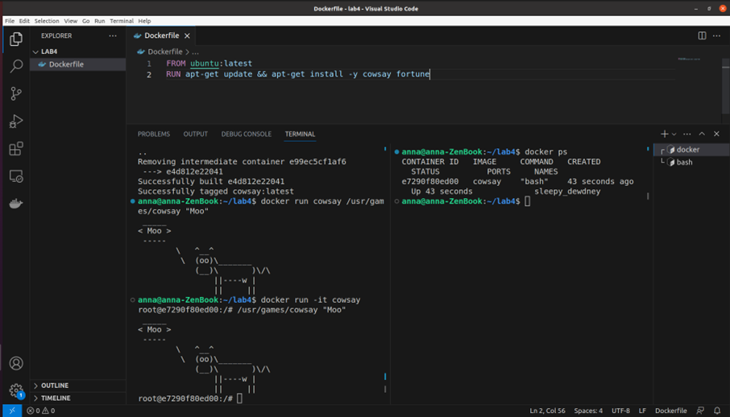
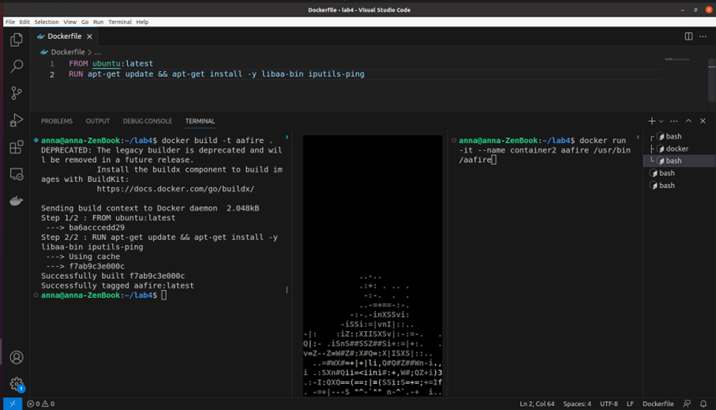
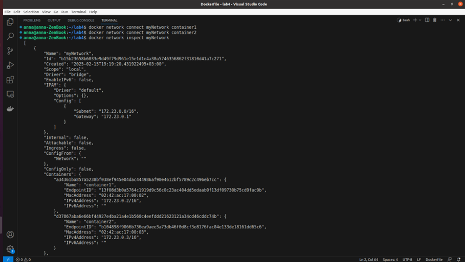
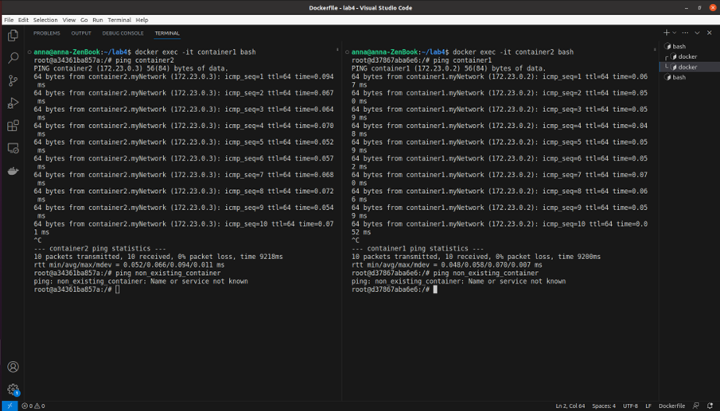

# Лабораторная работа №3. Виртуализация

## Цель работы
Изучить принципы контейнеризации средствами Docker.

## Задание
Запустить в Docker-контейнере приложение “aafire”. Настроить сеть между двумя контейнерами.

## Ход работы

Работа выполнялась на операционной системе Linux через приложение VsCode, так как оно имеет удобный интерфейс.

### Подготовка к работе

В соответсвии с примером, приведенным в задании лабораторной работы, был собран Docker-контейнер с приложением cowsay. Результат работы можно видеть на изображении.

### Выполнение работы

По [совету](https://stackoverflow.com/questions/79227937/how-to-install-aafire-in-docker-on-ubuntu-base-image) со StackOverflow был написан Dockerfile для запуска приложения aafire (было не очевидно, что нужна libaa-bin). Также была установлена утилита ping. Содержимое Dockerfile, сборка образа и пример запуска контейнера приведены на скриншоте.

Была настроена сеть между двумя контейнерами.

С помощью утилиты ping была протестирована связность между контейнерами. Для подключения к контейнеру в интерактивном режиме можно выполнить команду `docker exec -it <container-name> sh`.

## Заключение
В ходе выполнения лабораторной работы были созданы и запущены два контейнера с приложением aafire, настроена и протестирована сеть между данными контейнерами.
